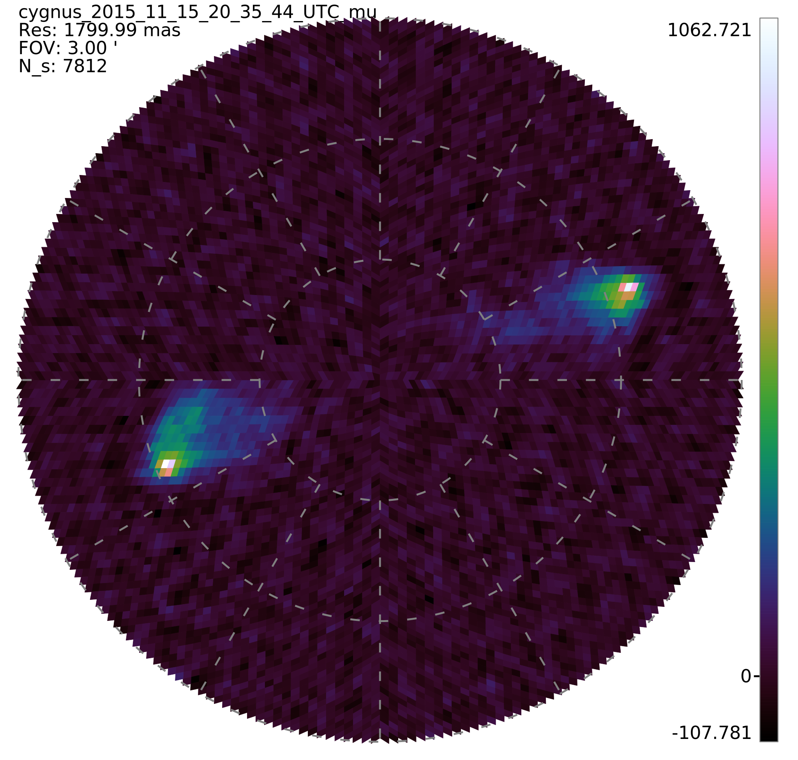

# Bayesian Radio Imaging

Various bits of code and testbenches for imaging using NIFTy and DiSkO. There are three directories described below.

## Test Data

Located in the test_data directory is a script to download necessary data for these examples.
J1939.64

log(S) = a_0 + \sum_{i=1}^n a_i * log(V_g)^i

where:
     a_0 = 1.4516±0.0010
     a_1 = −0.6961±0.0017
     a_2 = −0.201±0.005
     a_3 = 0.064±0.004
     a_4 = −0.046±0.004
     a_5 = 0.029±0.003

     
Use the set-jansky command in casa. This will download the perley butler expression for S (or the coefficients).

Reynolds scale.

## NIFTy

## DiSk0

Type make to generate a DiSkO image from the TART and cygnus data. An example is shown below

